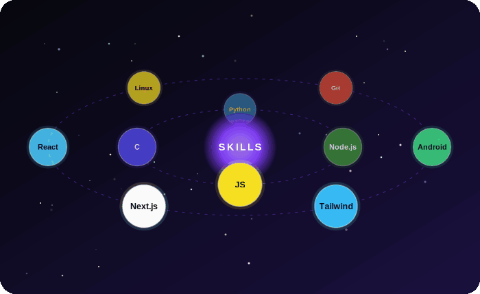

 

---

## 🧭 About Me

<table>
<tr>
<td width="50%" valign="top">

### 🎓 The Student
BCA student at **Govt. Degree College Pulwama**, Kashmir.

- 🐍 Python & DBMS
- 🧠 C programming & software architecture
- 📖 Learning something new every semester

</td>
<td width="50%" valign="top">

### ⚙️ The Builder
Turning ideas into working software, all from an Android phone.

- 📱 Android OS & custom ROM development
- 🎨 UI/UX & promotional design
- 🎬 Advanced video editing
- 🧊 3D web experiences

</td>
</tr>
</table>

---

## 🪐 Skills Orbit

 

---

## 🚀 Let's Build

*Got an idea? Let's turn it into something real.*

 

